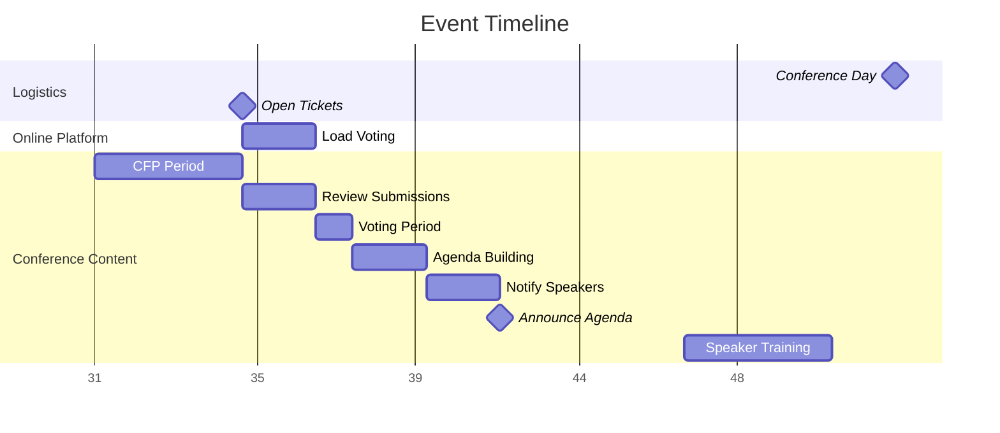

```mermaid
gantt
	title Event Timeline
	axisFormat %U
	todayMarker off

	%% This is based off an imaginary conference date of 31 Dec 2022, counting backwards from there to estimate timeline. The x-axis are numbered as weeks of the year, with the conference being on week 52

	section Logistics
		Conference Day: milestone, 2022-12-31, 0d
		Open Tickets: milestone, after c1, 0d

	section Online Platform
		Load Voting: o1, after c1, 2w

	section Conference Content
		CFP Period: c1, 2022-08-01, 4w
		Review Submissions: c2, after c1, 2w
		Voting Period: c3, after c2, 1w
		Agenda Building: c4, after c3, 2w
		Notify Speakers: c5, after c4, 2w
		Announce Agenda: milestone, c6, after c5, 0d
		Speaker Training: c7, 2022-11-21, 4w
```